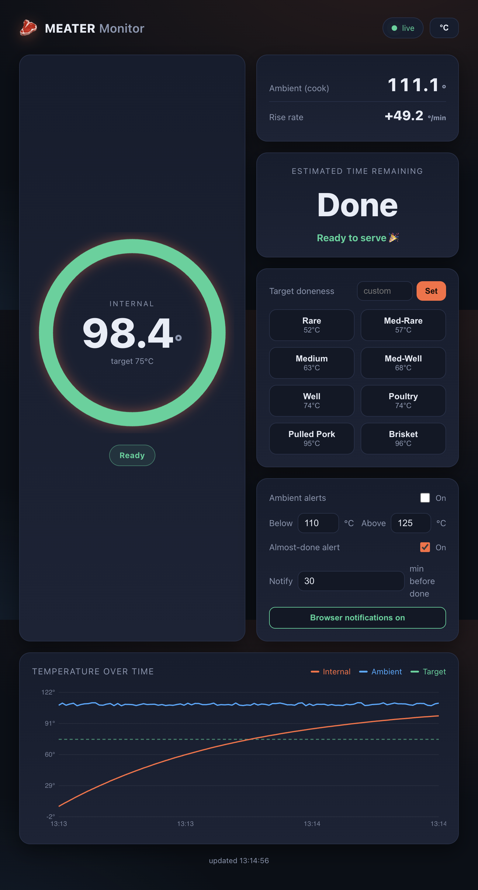

# meater-golang

Read the [MEATER](https://meater.com/) wireless meat thermometer probe over
Bluetooth Low Energy from Go — with a clean, self-hosted web UI.

The program scans for a probe advertising the name `MEATER`, connects to it,
subscribes to the temperature characteristic, decodes the **tip** (internal
meat) and **ambient** (cook) temperatures, and serves a live dashboard with a
temperature chart, doneness targets, ETA, and browser alerts. It also prints
readings to the console.



## Features

- **Live web dashboard** with a temperature-over-time chart (internal, ambient,
  and target lines).
- **Real-time updates** pushed over Server-Sent Events (`/api/stream`) — no
  polling, and multiple browsers can watch the same cook at once.
- **Doneness presets** (rare → brisket) and a custom target with an estimated
  time-to-target.
- **Alerts**: ambient out-of-range and "almost done" notifications, with a beep
  and (over HTTPS) native browser/PWA notifications.
- **Mock mode** to explore the UI with simulated data — no probe or Bluetooth
  required.
- **Optional TLS**: runs on plain HTTP by default; you *can* add HTTPS with
  built-in ACME (Let's Encrypt), your own certificate, or a reverse proxy — but
  you don't have to.

## Requirements

- A charged MEATER probe removed from its charging block (the probe only
  advertises when it is out of the block).
- For a real probe: a Bluetooth LE adapter.
  - **macOS**: the first run triggers a Bluetooth permission prompt; allow it.
  - **Linux**: requires BlueZ. You may need elevated privileges or the
    `cap_net_raw` capability on the binary.
- For building from source: Go 1.26+.

This project uses [`tinygo.org/x/bluetooth`](https://github.com/tinygo-org/bluetooth),
which works on macOS, Linux (BlueZ), and Windows. On Linux the BLE backend talks
to BlueZ over D-Bus in pure Go, so the binary builds fully static with
`CGO_ENABLED=0`.

## Quick start

```sh
go run . -mock        # explore the web UI with simulated data
```

Then open <http://localhost:8080/>. With a real probe, just drop `-mock`:

```sh
go run .              # scan, connect, and serve the dashboard on :8080
```

Console output looks like:

```
10:42:31 scanning for MEATER probe...
10:42:33 connecting to 7C:2F:...
10:42:34 connected, discovering services...
10:42:35 tip: 22.4°C (72.3°F)  ambient: 24.1°C (75.4°F)
```

Press `Ctrl+C` to disconnect and exit.

## Install

### Option A — Docker (ready to go)

A multi-stage [`Dockerfile`](Dockerfile) builds a tiny static image, and
[`docker-compose.yml`](docker-compose.yml) wires up everything for a real probe
on a **Linux** host (it uses the host network and the host D-Bus so the
container can reach BlueZ):

```sh
docker compose up -d --build
# open http://<host>:8080/
```

The image is also published to GHCR by a GitHub Actions workflow
([`.github/workflows/docker-publish.yml`](.github/workflows/docker-publish.yml))
on every push to `main` and on `v*` tags, so you can pull it instead of
building:

```sh
docker pull ghcr.io/awlx/meater:latest
```

> The compose file references `ghcr.io/awlx/meater:latest`. With `--build` it
> builds locally; without it, Docker pulls from GHCR (make the GHCR package
> public once after the first publish to allow anonymous pulls).

To just try the UI without a probe (works anywhere, including macOS/Windows
Docker Desktop):

```sh
docker build -t meater . && docker run --rm -p 8080:8080 meater -mock -http :8080
```

> BLE inside Docker requires a Linux host with Bluetooth, the host network, and
> access to the host D-Bus system bus (all preconfigured in the compose file).
> If the probe won't connect, uncomment `cap_add` or `privileged` in the compose
> file.

### Option B — Binary + systemd

Build a static binary and install it:

```sh
go install github.com/awlx/meater-golang@latest   # installs to $(go env GOPATH)/bin
# or build locally:
CGO_ENABLED=0 go build -o meater .
sudo install -D -m 0755 meater /opt/meater/meater
```

A sample unit lives at [`deploy/meater.service`](deploy/meater.service). Copy it
to `/etc/systemd/system/`, adjust `User` and the paths to match your install,
then:

```sh
sudo systemctl daemon-reload
sudo systemctl enable --now meater.service
```

On Linux, allow the binary to use BLE without running as root:

```sh
sudo setcap 'cap_net_raw,cap_net_admin+eip' /opt/meater/meater
```

## Flags

| Flag                | Default      | Description                                                                       |
| ------------------- | ------------ | -------------------------------------------------------------------------------- |
| `-addr`             | (none)       | Connect to a specific BLE MAC (e.g. `AA:BB:CC:DD:EE:FF`) instead of matching by name. |
| `-scan-window`      | `15s`        | How long each scan attempt runs before retrying.                                 |
| `-timeout`          | `0`          | Give up after this long (`0` = retry forever).                                    |
| `-connect-retries`  | `3`          | Connection attempts before rescanning.                                           |
| `-connect-timeout`  | `25s`        | Abort a single connection attempt that hangs (BlueZ can stall).                  |
| `-http`             | `:8080`      | Address for the plain-HTTP server (also serves ACME challenges / HTTPS redirect).|
| `-https`            | `:8443`      | Address for the HTTPS server (used when TLS is enabled).                          |
| `-acme-domain`      | (none)       | Get a Let's Encrypt cert automatically for this domain (e.g. `meater.example.com`). |
| `-acme-cache`       | `acme-certs` | Directory to cache ACME certificates in.                                         |
| `-tls-cert`         | (none)       | Path to a TLS certificate file (use with `-tls-key`).                            |
| `-tls-key`          | (none)       | Path to a TLS private key file (use with `-tls-cert`).                           |
| `-target`           | `63`         | Default target tip temperature in Celsius.                                       |
| `-mock`             | `false`      | Simulate a probe instead of using Bluetooth (for UI testing).                    |
| `-bridge`           | (none)       | Read the probe from a networked ESP32 BLE bridge at `host:port` instead of a local adapter. |
| `-db`               | `meater.db`  | SQLite file for cook history (empty string disables persistence).                |
| `-cook-idle`        | `30m`        | Finish the current cook after this long without a reading (covers BLE drops/reconnects). |

The program retries scanning automatically, so you can start it before freeing
the probe and it will connect as soon as the probe begins advertising:

```sh
go run . -addr AA:BB:CC:DD:EE:FF -scan-window 12s
```

## Remote probe over a networked ESP32 bridge (`-bridge`)

The host running this program has to be within Bluetooth range of the probe,
which is awkward when the grill is outside and the server is in a cupboard. A
cheap PoE ESP32 (e.g. an **Olimex ESP32-POE-ISO**) can act as the radio instead:
it holds the BLE link and forwards the probe's readings over Ethernet.

```
MEATER ~BLE~> ESP32-POE-ISO ──PoE/Ethernet──> meater-golang (dashboard, history, ETA)
```

Firmware, wiring and troubleshooting: **[`firmware/`](firmware/)**.

```sh
cd firmware && pio run -t upload    # flash the board, note the IP it prints
cd .. && go build -tags nobluetooth -o meater .
./meater -bridge 192.168.1.42:9000
```

The bridge is a peer of the local BLE source, not a replacement: `Start` dials
the board, `Stop` hangs up, and everything downstream (decoding, history, ETA,
alerts) is identical. The board forwards the probe's **raw** payload, so
`internal/meater.ParseTemperature` remains the only decoder in the project and
the two transports cannot drift apart.

> **Note:** the ESP32 cannot run this program itself — it is a microcontroller
> with no OS, and `modernc.org/sqlite`, BlueZ/D-Bus and `net/http` all need a
> POSIX host. It is the radio, not the computer.

### Building without a local Bluetooth stack

`-tags nobluetooth` compiles out the local BLE backend, leaving `-bridge` and
`-mock`. It is optional on Linux, but **required on macOS**: macOS aborts
(SIGABRT, a few hundred ms after startup, with no error message) any long-lived
unsigned binary that links CoreBluetooth without a Bluetooth usage description
in a signed app bundle. Importing `tinygo.org/x/bluetooth` is enough to trigger
it, so without the tag the app dies at startup on macOS even in `-bridge` or
`-mock` mode, where Bluetooth is never used.

The same applies to the tests — on macOS, use:

```sh
go test -tags nobluetooth ./...
```

Plain `go test ./...` aborts in the root package there for the same reason (its
test binary links CoreBluetooth). Linux and CI are unaffected.

## HTTPS / TLS is optional

By default the app serves **plain HTTP** — that's perfectly fine on a trusted
home network. Pick whichever of these suits you:

- **Nothing** — plain HTTP on `-http` (default `:8080`). Note: native browser
  notifications and the PWA service worker require a *secure context*, so over
  plain HTTP only the in-page beep/banner alerts work.
- **Built-in ACME** — add `-acme-domain meater.example.com`. The app obtains and
  renews a Let's Encrypt certificate, redirects HTTP→HTTPS, and serves TLS on
  `-https`. Needs the domain to resolve to the host and ports 80/443 reachable.
- **Your own certificate** — `-tls-cert cert.pem -tls-key key.pem` to serve TLS
  with a certificate from any ACME client or CA.
- **Reverse proxy** — keep the app on plain HTTP and let nginx/Caddy/HAProxy/
  Traefik terminate TLS in front of it.

## Multiple viewers and one probe

The web UI supports **multiple simultaneous clients** — every browser gets its
own Server-Sent Events stream, so phones and laptops can all watch the same cook
live.

The *probe* itself is a standard BLE peripheral that accepts **a single
connection**. While your phone (or the MEATER app) is connected, the probe stops
advertising and this program can't discover it. If it reports "no probe found",
close the MEATER app or disable Bluetooth on the phone so the probe advertises
again. Both the original `MEATER` and the long-range `MEATER+` are matched
automatically.

## Project layout

| Path                                | Purpose                                                  |
| ----------------------------------- | -------------------------------------------------------- |
| `main.go`                           | Flags, source selection, HTTP(S) server startup.          |
| `ble.go` / `ble_disabled.go`        | Local BLE source: scan/connect/subscribe. Compiled out by `-tags nobluetooth`. |
| `bridge.go`                         | Remote source: reads the probe from a networked ESP32 BLE bridge (`-bridge`). |
| `internal/meater/meater.go`         | BLE UUIDs and the temperature payload decoder.           |
| `internal/monitor/monitor.go`       | Thread-safe state, history, ETA, and SSE fan-out.        |
| `internal/server/server.go`         | HTTP routes, JSON API, and the SSE stream.               |
| `internal/server/web/`              | Static dashboard (HTML/CSS/JS, PWA manifest, worker).    |
| `bluez_linux.go` / `bluez_other.go` | Platform helpers for BlueZ.                              |
| `firmware/`                         | ESP32 bridge firmware (PlatformIO/C++, not part of the Go module). |
| `deploy/meater.service`             | Sample systemd unit.                                     |
| `Dockerfile` / `docker-compose.yml` | Container build and ready-to-run Compose setup.          |

## How the decoding works

The temperature characteristic delivers a little-endian sequence of `uint16`
sensor values. This program targets the 12-byte "resolution 32" payload used by
recent MEATER+ firmware:

- `data[0:2]` — internal (meat tip) sensor.
- `data[10:12]` — ambient (cook) sensor.

Each raw value is converted to Celsius with the probe's fixed scale
`(raw + 8) / 32`. The `/32` scale lets the internal channel span the full
cooking range (a 95 °C target is raw 3032) instead of saturating near 64 °C, and
the ambient sensor at offset 10 is the channel that visibly swings with the cook
temperature. Both were validated against the official app. See
[`internal/meater/meater.go`](internal/meater/meater.go) for the exact formula
and [`internal/meater/meater_test.go`](internal/meater/meater_test.go) for
validated sample payloads.

> Note: the MEATER BLE protocol is not officially published. The decoding here
> follows community reverse-engineering of the probe and was checked against the
> official app's readout.

## Acknowledgements

Thanks to [`nathanfaber/meaterble`](https://github.com/nathanfaber/meaterble)
for the community reverse-engineering pointers — it was a helpful reference for
where to look in the BLE GATT services and temperature payload.
