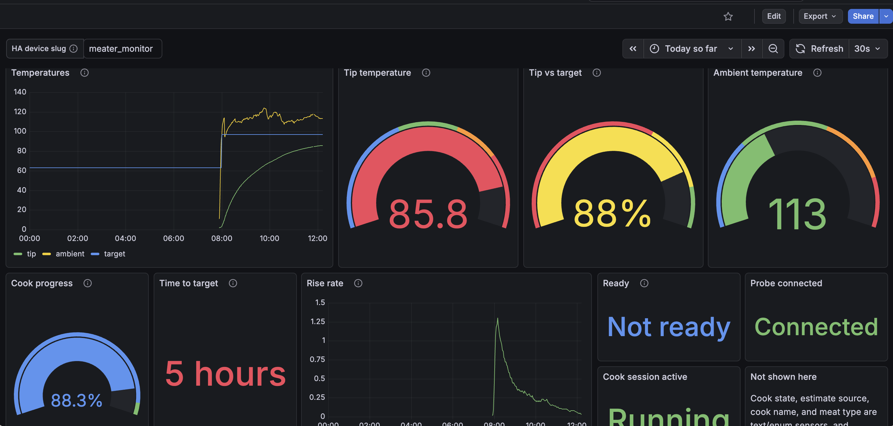

# Grafana dashboards

Two ready-made dashboards live in **[docs/grafana/](.)**, one per metrics
source — pick whichever matches how you scrape this project, or import both.

| File                                                                     | Data source                                                              |
| -------------------------------------------------------------------------- | --------------------------------------------------------------------------- |
| **[meater-native.json](meater-native.json)**                 | Scrapes meater-golang's own **[`/metrics`](../metrics.md)** endpoint directly. |
| **[meater-homeassistant.json](meater-homeassistant.json)** | Scrapes the **[Home Assistant integration](../home-assistant.md)**'s entities back out of HA's own `prometheus:` integration. |

## Import

In Grafana: **Dashboards → New → Import**, upload the JSON file, and pick your
Prometheus datasource when prompted. Both dashboards refresh every 30s and
default to the last 6 hours.

## Native dashboard

Straightforward — every panel queries a `meater_*` series directly (see
[docs/metrics.md](../metrics.md) for the full list). It has an `instance`
variable in case you scrape more than one meater-golang host from the same
Prometheus.

## Home Assistant dashboard

Home Assistant derives the actual Prometheus metric name for each entity from
its unit/device class, and that mapping can vary between HA versions. Rather
than hardcode a guess, every query matches on the `entity` label instead (e.g.
`{entity="sensor.meater_monitor_internal_temperature"}`), filtered down to the
domain's metric name prefix (`homeassistant_sensor_.*` or
`homeassistant_binary_sensor_.*`) — HA's real per-entity value metrics are
always named with the domain baked in, while its generic cross-domain metadata
metrics (entity availability, last-updated/changed timestamps) are not, so this
excludes those without needing to enumerate them by name.

An `entity_prefix` dashboard variable (default `meater_monitor`) controls the
entity_id prefix, in case you renamed the integration's device.

Cook state, estimate source, cook name, meat type, and the timestamp sensors
(`ready_at`, `cook_started`) are left off this dashboard: they're string/enum/
timestamp sensors, and Home Assistant's Prometheus exporter generally doesn't
publish non-numeric sensor states as a scrapeable value. View those directly in
Home Assistant, or on the native dashboard if you also scrape meater-golang
directly.

If a panel is empty or looks wrong on your instance, open your HA instance's
`/api/prometheus` output and search for the entity_id to see exactly what
metric name(s) it produced, then adjust the query's `__name__` filter.
