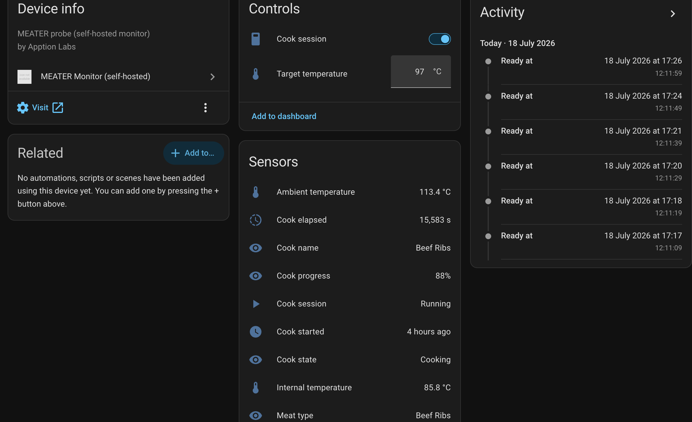

# Home Assistant (via HACS)

This repository doubles as a [HACS](https://hacs.xyz/) custom repository, so your
cook shows up in Home Assistant as a normal device with sensors you can put on a
dashboard, chart, and automate against.

It talks to *your* instance over the local API — it never touches the MEATER
cloud. (For the cloud, use Home Assistant's built-in `meater` integration; the
two can coexist, which is why this one uses the `meater_golang` domain.)



## Install

1. In Home Assistant: **HACS → ⋮ → Custom repositories**.
2. Add `https://github.com/awlx/meater-golang` with type **Integration**.
3. Install **MEATER Monitor (self-hosted)** and restart Home Assistant.
4. **Settings → Devices & services → Add integration → MEATER Monitor**, then
   enter the same host and port you open the dashboard on (e.g. `meater.local`,
   port `8080`).

Requires Home Assistant 2025.3.0 or newer.

The integration ships its own brand icon (`custom_components/meater_golang/brand/`),
which Home Assistant 2026.3.0+ renders automatically wherever the integration is
shown (HACS listing, integrations page, device page). On older versions the icon
just falls back to the generic placeholder — everything else still works.

## Entities

| Entity                        | Notes                                                         |
| ----------------------------- | ------------------------------------------------------------- |
| `sensor.*_internal_temperature` | Tip (meat) temperature.                                       |
| `sensor.*_ambient_temperature`  | Cook chamber temperature.                                     |
| `sensor.*_target_temperature`   | Current target.                                               |
| `sensor.*_cook_progress`        | Percent of the climb **from where the cook started** to the target. |
| `sensor.*_time_to_target`       | ETA as a duration; unknown during a deep stall.               |
| `sensor.*_ready_at`             | ETA as a wall-clock time, the number you actually plan around. |
| `sensor.*_rise_rate`            | °C/min from the rate fit.                                     |
| `sensor.*_cook_state`           | `idle`/`disconnected`/`waiting`/`cooking`/`stalled`/`ready`.   |
| `sensor.*_cook_name` / `_meat_type` / `_cook_started` / `_cook_elapsed` | Session details.        |
| `binary_sensor.*_ready`         | On when the tip reaches the target — the one to automate on.   |
| `binary_sensor.*_cook_session`  | On while discovery is running.                                |
| `binary_sensor.*_probe_connected` | BLE link health.                                             |
| `number.*_target_temperature`   | Set the target from Home Assistant.                           |
| `switch.*_cook_session`         | Start/stop a session. Starting always opens a **new** cook.   |

The estimate's low/high bounds, its source, the cook ID, and a stalled-problem
sensor are also available as diagnostic entities, disabled by default.

An example "shout when the brisket is done" automation:

```yaml
automation:
  - alias: MEATER ready
    triggers:
      - trigger: state
        entity_id: binary_sensor.meater_monitor_ready
        to: "on"
    actions:
      - action: notify.mobile_app
        data:
          message: >-
            {{ state_attr('sensor.meater_monitor_cook_name', 'friendly_name') }}
            is done — {{ states('sensor.meater_monitor_internal_temperature') }}°C.
```

Progress is measured from the temperature the cook *started* at, not from 0 °C:
a steak going 20 °C → 55 °C is genuinely half done at 37 °C, where naive
`tip / target` arithmetic would have called it two-thirds done before it hit the
pan.

If you also scrape Home Assistant's own `prometheus:` integration, there's a
ready-made dashboard for these entities in **[docs/grafana/](grafana/)**.
